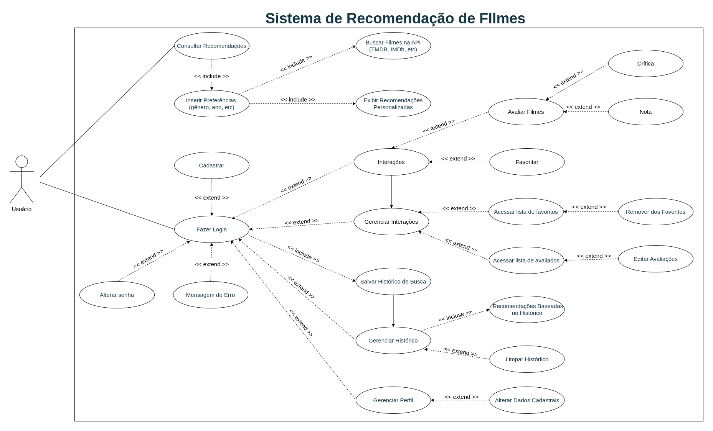

# TCC - Etec

  
UML

Este diagrama de casos de uso ilustra as principais funcionalidades do **Sistema de Recomendação de Filmes**. De modo a esclarecer a lógica, irei descreve detalhadamente cada ator, caso de uso, e as interações representadas.

### Atores:
1. **Usuário Não Logado**: 
   - Um usuário que acessa o sistema sem realizar login. Pode buscar recomendações de filmes, mas não tem acesso a funcionalidades de personalização e gestão de histórico.

2. **Usuário Logado**:
   - Após fazer login, o usuário tem acesso a funcionalidades adicionais, como salvar e gerenciar o histórico de busca, interagir com os filmes (avaliar, favoritar, comentar), e gerenciar seu perfil.

### Casos de Uso:

1. **Buscar Recomendação de Filmes** (disponível para todos os usuários):
   - O usuário pode inserir suas preferências (gênero, ano, nota, etc.) e obter uma lista de filmes recomendados com base nessas informações.
   - Para ambos os tipos de usuários, a funcionalidade de buscar filmes se aplica igualmente. Não há necessidade de login para usá-la.

2. **Fazer Login:**

    - Usuários que possuem cadastro no sistema podem fazer login, ganhando acesso a funcionalidades exclusivas. 
    - `<<extend>>`: Funções como **Gerenciar Histórico**, **Gerenciar Interações**, **Salvar Histórico de Busca**, e **Gerenciar Perfil** estendem o login, ou seja, essas funcionalidades só estão disponíveis após o login ser efetuado.
    - Caso o login falhe, o sistema exibirá uma **Mensagem de Erro**.
    - Se for preciso, **Alterar Senha** é uma opção oferecida ao usuário que tenta realizar o login.

3. **Salvar Histórico** (disponível apenas para Usuário Logado) – `<<include>>` de "Buscar Recomendação de Filmes":
   - Após buscar recomendações, o sistema salva automaticamente as buscas e os filmes recomendados no histórico de preferências do usuário.
   - Este caso de uso é automaticamente incluído quando o usuário faz a busca e está logado.

4. **Gerenciar Histórico** (disponível apenas para Usuário Logado) – `<<extend>>` de "Salvar Histórico":
   - O usuário logado pode visualizar, editar, ou excluir buscas anteriores e recomendações salvas.
   - Este é um caso de uso opcional e estendido, pois o usuário pode optar por realizar essa ação, mas não é um processo automático.
   - Dentro do gerenciamento do histórico, o sistema oferece automaticamente **Recomendações Baseadas no Histórico**. 

5. **Gerenciar Interações** (disponível apenas para Usuário Logado):
- Usuários logados podem gerenciar suas interações com os filmes recomendados, como favoritar, avaliar, e comentar sobre filmes.
-  **Gerar Interações** e **Gerenciar Interações** estão conectadas, pois após o usuário gerar interações, ele pode querer gerenciá-las. Porém, a conexão é representada como um uso comum, sem que uma dependa da outra diretamente.
- `<<extend>>`: A partir de **Favoritar Filmes**, o usuário pode acessar a lista de favoritos e remover filmes dessa lista.
- `<<extend>>`: A partir de **Avaliar Filmes**, o usuário pode acessar a lista de avaliações e editar suas avaliações anteriores.

6. **Gerenciar Perfil**(disponível apenas para Usuário Logado) – `<<extend>>` de "Fazer Login"::
- Usuários logados podem gerenciar informações do seu perfil, como alterar senha ou dados cadastrais.
.

  
Construção da API

Para facilitar o desenvolvimento da  Api, dividi em partes o que cada pasta e arquivo deve conter, considerando as funcionalidades necessárias para o aplicativo de recomendação de filmes.

### 1. **firebase**
O Firebase pode ser usado para autenticação e armazenamento de dados em nuvem. Você precisará desenvolver a configuração e algumas funcionalidades relacionadas à autenticação.

#### a) `firebase/firebase_config.py`
- **O que desenvolver:**  
  Inicializa o Firebase dentro do seu aplicativo. Isso envolve carregar as credenciais e inicializar o SDK.
  
- **Objetivo:**  
  Configurar o Firebase, para que as funções de autenticação e outros serviços possam ser usados em todo o app.

#### b) `firebase/auth.py`
- **O que desenvolver:**  
  Funções relacionadas à autenticação, como criar usuários, verificar tokens de autenticação, e talvez login.
  
- **Objetivo:**  
  Implementar autenticação de usuários com Firebase, permitindo que eles se autentiquem e acessem os recursos protegidos da API.

### 2. **middlewares**
Os middlewares são funções que são executadas antes ou depois das suas rotas, como verificação de autenticação ou logs.

#### a) `middlewares/auth_middleware.py`
- **O que desenvolver:**  
  Um middleware que verifica a autenticação dos usuários antes de permitir o acesso às rotas protegidas.
  
- **Objetivo:**  
  Garantir que as rotas protegidas da sua API só possam ser acessadas por usuários autenticados.

#### b) `middlewares/logging_middleware.py`
- **O que desenvolver:**  
  Um middleware que registra informações sobre as requisições e respostas.
  
- **Objetivo:**  
  Manter um registro detalhado de todas as requisições e respostas para monitorar e depurar o sistema.

### **3. database**
Aqui, iremos utilizar o SQLite para armazenar e consultar dados de filmes ou outras informações relevantes do usuário.

#### a) `database/database.py`
- **Objetivo**: Configurar e estabelecer uma conexão com SQLite.
- **Função**: Criar e gerenciar o banco `filmes.db`, garantindo que as tabelas sejam criadas corretamente.

#### b) `database/schema.sql`
- **Objetivo**: Definir a estrutura das tabelas do SQLite.
- **Função**: Contém os comandos SQL para criação das tabelas.

#### c) `database/repository.py`
- **Objetivo**: Facilitar a interação com o banco SQLite.
- **Função**: Permitir adição, consulta e remoção de dados no SQLite.

**Principais Tabelas do SQLite:**
- `usuarios`: Armazena informações de usuários.
- `filmes`: Contém os filmes cadastrados no sistema.
- `avaliacoes`: Armazena avaliações dos filmes.
- `favoritos`: Guarda os filmes favoritos de cada usuário.
- `historico_visualizacao`: Registra os filmes assistidos.
- `preferencias_usuario`: Armazena preferências de gênero e diretores favoritos.
- `interacoes`: Registra interações do usuário com o sistema.
- `filmes_api`: Armazena informações sobre filmes vindos da API TMDb.
- `configuracoes_api`: Armazena informações necessárias para acessar a API TMDb, como chaves de API, endpoints ou cache de respostas.

### 4. **validators**
Os validadores são importantes para garantir que os dados enviados para as rotas da API estão no formato correto. Aqui, você vai validar os dados de entrada, como informações de filmes e usuários.

#### a) `validators/user_validators.py`
- **O que desenvolver:**  
  Validar os dados de entrada do usuário, como o formato de e-mail e a força da senha.
  
- **Objetivo:**  
  Garantir que os dados fornecidos pelo usuário estejam corretos e seguros antes de serem processados.

#### b) `validators/movie_validators.py`
- **O que desenvolver:**  
  Validar os dados relacionados aos filmes, como título, gênero, ano de lançamento, e nota.
  
- **Objetivo:**  
  Garantir que os dados de filmes estejam no formato correto antes de serem armazenados ou utilizados em buscas no TMDB.

---

### Exemplo Prático de Uso:

Imagine que um usuário queira acessar sua rota `/recommendation/` e receber recomendações de filmes baseadas em suas preferências. Aqui está como as diferentes partes que você vai desenvolver funcionarão juntas:

1️⃣ O usuário faz login via Firebase, que gera um token JWT.
2️⃣ O middleware `auth_middleware.py` verifica a autenticidade do token.
3️⃣ Os validadores garantem que os dados enviados estão corretos.
4️⃣ O SQLite armazena e recupera informações de filmes e usuários.
5️⃣ A API do TMDb é consultada para buscar recomendações de filmes.
6️⃣ O middleware de logging registra tudo para monitoramento.

Essa arquitetura distribui bem as responsabilidades, facilitando a manutenção e a escalabilidade do sistema.

  
Planejamento

---

## **Fase 1: Planejamento e Configuração Inicial**
### 🔹 **Definir Arquitetura e Tecnologias**
- Banco de dados: **SQLite**
- Backend: **Flask (Python)**
- Autenticação: **Firebase Authentication**
- APIs externas: **TMDb para informações de filmes**
- Machine Learning: **Modelo básico de recomendação**
- Infraestrutura: **Railway/Render para banco e API**

### 🔹 **Criar Estrutura do Repositório e Configuração Básica**
**Responsáveis**: Time de Backend  
- Criar estrutura de diretórios (`firebase/`, `middlewares/`, `mongo/`, `validators/`, etc.).
- Definir o **`requirements.txt`** com dependências.
- Criar o arquivo **`.env`** para armazenar chaves de API e credenciais.

---

## **Fase 2: Banco de Dados, Autenticação e Frontend**
### 🔹 **Banco de Dados**
**Responsáveis**: Time de Backend  
✅ Criar **SQLite** para armazenar preferências e interações.  
✅ Implementar conexões com SQLite.

### 🔹 **Autenticação Firebase**
**Responsáveis**: Time de Backend  
✅ Criar **`firebase/firebase_config.py`** para inicializar Firebase.  
✅ Criar **`firebase/auth.py`** para autenticar usuários via JWT.  
✅ Criar **middleware `middlewares/auth_middleware.py`** para validar usuários nas rotas protegidas.  

### 🔹 **Criação de Interface Web**
**Responsáveis**: Time de Frontend  
✅ Criar interface simples com **React**.  
✅ Implementar autenticação via Firebase.  
✅ Criar página de recomendações dinâmicas.

---

## **Fase 3: Funcionalidades Principais**
### 🔹 **Módulo de Filmes (TMDb API)**
**Responsáveis**: Time de Backend  
✅ Criar **`controllers/movie_controller.py`** para buscar filmes via TMDb.  
✅ Criar **`mongo/repository.py`** para salvar filmes recomendados no MongoDB.  
✅ Implementar **filtros básicos** (por gênero, ano, nota mínima).  

### 🔹 **Sistema de Avaliação**
**Responsáveis**: Time de Backend  
✅ Criar endpoints para que usuários avaliem filmes (`/avaliar`).  
✅ Armazenar avaliações no PostgreSQL.  
✅ Criar função para calcular **média das notas** e atualizar no MongoDB.  

---

## **Fase 4: Sistema de Recomendação Inicial**
### 🔹 **Primeira versão da recomendação**
**Responsáveis**: Time de Machine Learning  
✅ Implementar **filtragem colaborativa simples** (KNN ou SVD).  
✅ Criar **API `/recommendations`** baseada no histórico de filmes assistidos.  

### 🔹 **Integração da IA (opcional)**
**Responsáveis**: Time de Machine Learning  
✅ Implementar **FAISS para buscas vetoriais** (se necessário).  
✅ Criar embeddings dos filmes via OpenAI API ou modelo próprio.  
✅ Usar LangChain para chat interativo com IA.  

---

## **Fase 5: Testes**

### 🔹 **Testes e Refinamento**
**Responsáveis**: Todo o time  
✅ Testar endpoints e integração entre backend e frontend.  
✅ Ajustar modelo de recomendação conforme feedbacks.  

---

